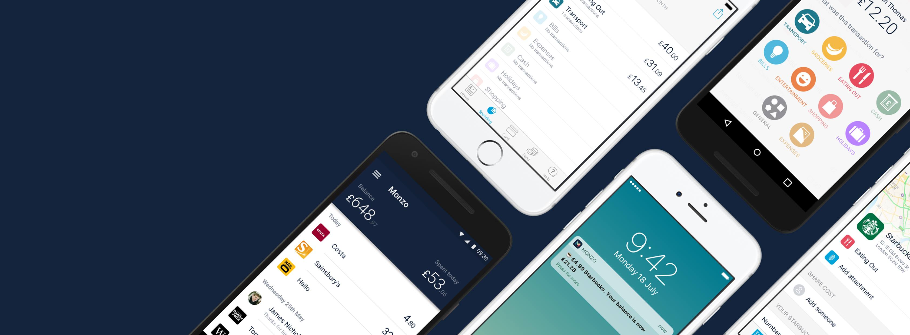

# monzo-cli
[](https://badge.fury.io/rb/monzo-cli)
[](https://travis-ci.org/cesarferreira/lasertag)  [](https://hakiri.io/github/cesarferreira/lasertag/master)
[](https://codeclimate.com/github/cesarferreira/monzo-cli)
[](http://inch-ci.org/github/cesarferreira/monzo-cli)

> Finally a bank with an API



# Usage
## Balance

```bash
$ monzo-cli balance

+---------+-------------+
| Balance | Spent today |
+---------+-------------+
| £490    | £10         |
+---------+-------------+
```

## Accounts

```bash
$ monzo-cli accounts

+---------------------+----------------------+
| Description         | Date created         |
+---------------------+----------------------+
| Peter Pans Account  | 2015-11-13T12:17:42Z |
+---------------------+----------------------+
```

## Install

```bash
gem install monzo-cli
```

Get your access tokens from this URL: https://developers.getmondo.co.uk/api/playground
  
  
Please create/edit it on `~/.monzo-cli.yml` with this format:


```yml
user_18231092askdas9212
account_id: acc_0aksdaklsjSh28181
access_token: Qnjdas8hakxdjasQscGVgnVGIVXpvpZ5uCxkQ5XLnDHnOPoBtXreQ6adBo

```
  
## Contributing
I welcome and encourage all pull requests. It usually will take me within 24-48 hours to respond to any issue or request. Here are some basic rules to follow to ensure timely addition of your request:
  1. If its a feature, bugfix, or anything please only change code to what you specify.
  2. Please keep PR titles easy to read and descriptive of changes, this will make them easier to merge :)
  3. Pull requests _must_ be made against `develop` branch. Any other branch (unless specified by the maintainers) will get rejected.
  4. Check for existing [issues](https://github.com/cesarferreira/monzo-cli/issues) first, before filing an issue.
  5. Have fun!

### Created & Maintained By
[Cesar Ferreira](https://github.com/cesarferreira) ([@cesarmcferreira](https://www.twitter.com/cesarmcferreira))
